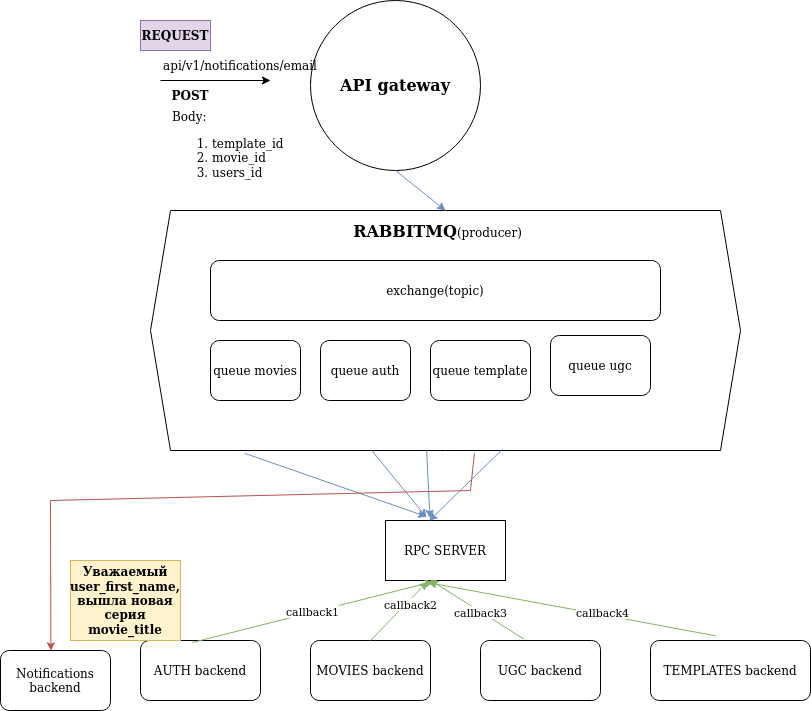

# NOTIFICATIONS SERVICE MVP

### архитектура

### комментарий

как я понимаю
---

* Цель на спринт: реализовать сервис нотификации, который реализует оповещение пользователей с помощью разных инструментов(электронная почта, мессенджер, смс); сервис должен предоставлять интерфейсы для создания нотификаций администраторами в ручном виде, создания автоматических рассылок (о выходе новой серии сериала, появлении нового фильма, об ответе на комментарий пользователя к фильму)

* Задачи:
1. создание нотификаций с помощью админ панели
2. автоматическое создание нотификаций
	1. реализация апи для получения фильма по его идентификатору
	2. реализация апи для получения пользователя по его идентификатору
	3. реализация апи для получения комментария к отзыву пользователя о фильме
	4. реализация апи для получения шаблона письма (
	  id:uuid, jinja_dict:str, jinja_params:dict
	  например:
	   id ...
	   jinja_dict: "Уважаемый {{ user_full_name }}, вышла новая серия {{ movie_title }}"
	   jinja_params ...
	) 
	5. реализовать api gateway +rpc server, который получает запрос на нотификацию

	    1. принимает запрос 
	  curl --header "Content-Type: application/json" \
	    --request POST \
	    --data '{"template_id":"1","movie_id":"1", "user_ids":"1, 2, 3"}' \
	    http://localhost:80/api/v1/notifications/email
	    2. запрос передается RabbitMQ паблишеру
	    3. от паблишера запрос идет в обменник
	    4.. запрос отправляется в очередь в соответствии с биндингом обменника
	    5. очередь слушает RPC-сервер, который делает вызовы апи (movies, auth, ugc, templates) и возвращает полученные данные
	    6. из полученных данных формируется текст нотификации и путь ее доставки(email, sms, messanger)
	    7. отправка нотиффикации с поммщью email/sms/messagner помещается в очередь; консьюмеры забирают его и осуществляют отправку

* [rabbitmq(publish/subscribe)](https://aio-pika.readthedocs.io/en/latest/rabbitmq-tutorial/3-publish-subscribe.html)
* [rabbitmq(rpc)](https://aio-pika.readthedocs.io/en/latest/rabbitmq-tutorial/6-rpc.html)